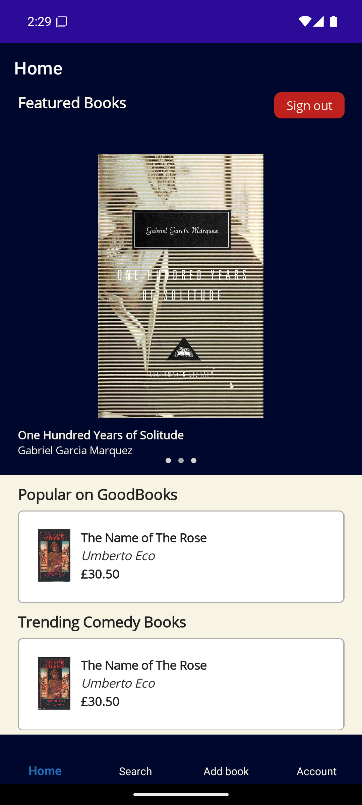
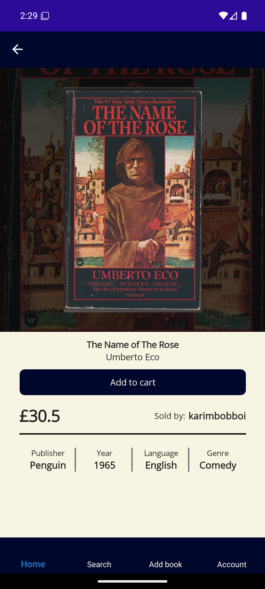
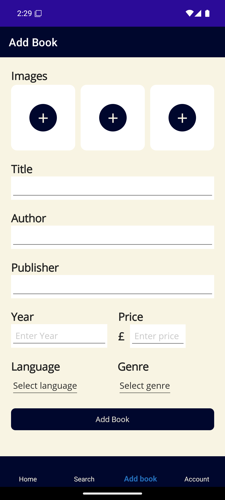

I made GoodBooks as part of my coursework for Fundamentals of Mobile Applications Development in my uni degree. It is a cross-platform app built with .NET MAUI that lets users buy, sell, and browse second-hand books. Users can create accounts, search, view, buy, and list books.

### Screenshots
#### Home
  

#### View book
  

#### List book

